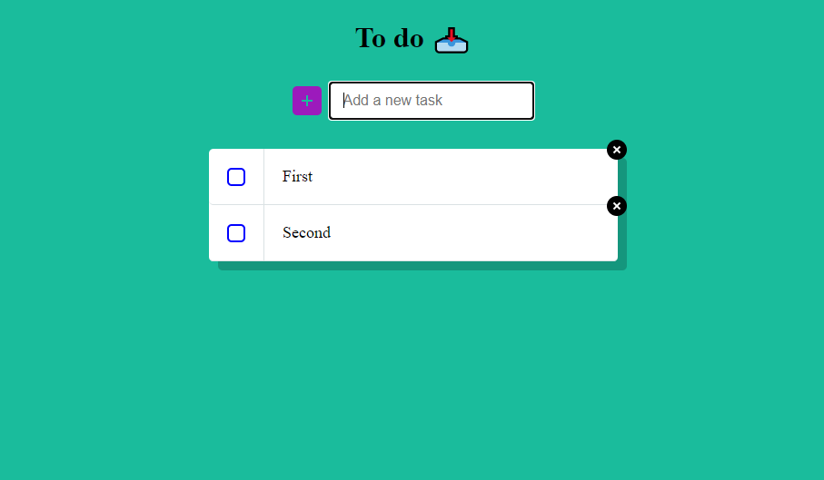

# Todo app

Todo App being created for personal use.

This App will use local storage and firebase to maintain the tasks and save states.

You will be able to use local storage to save a local todo list.

If you are logged in, you will be able to see your todo list accross multiple devices.

## Updates

Currently I'm rebuilding the app architecture based on the MVC (Model-View-Controller) Architecture.

Having some issues with saving the checked state 🐞.

Testing website doesn't have the latest code at the moment

### Using

This App uses the following:

- JavaScript
- HTML
- SCSS
- Parcel
- Firebase

#### Thumbnail

